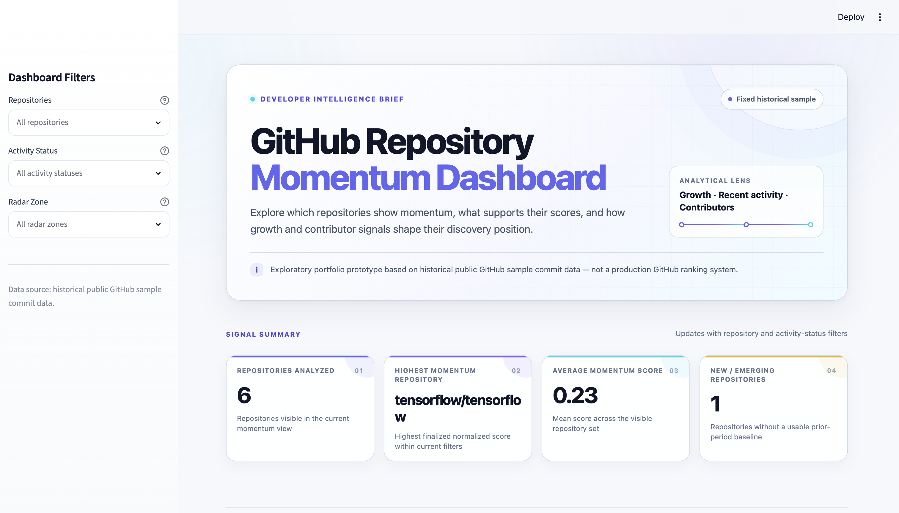
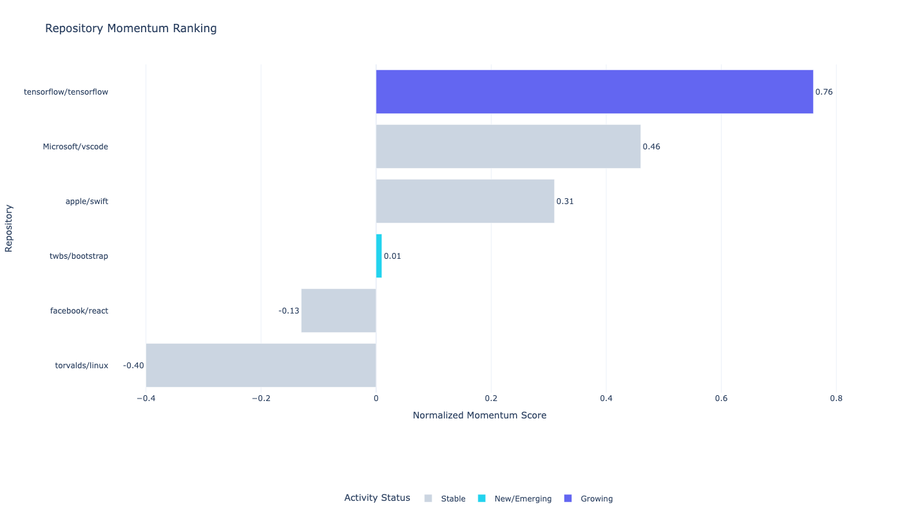
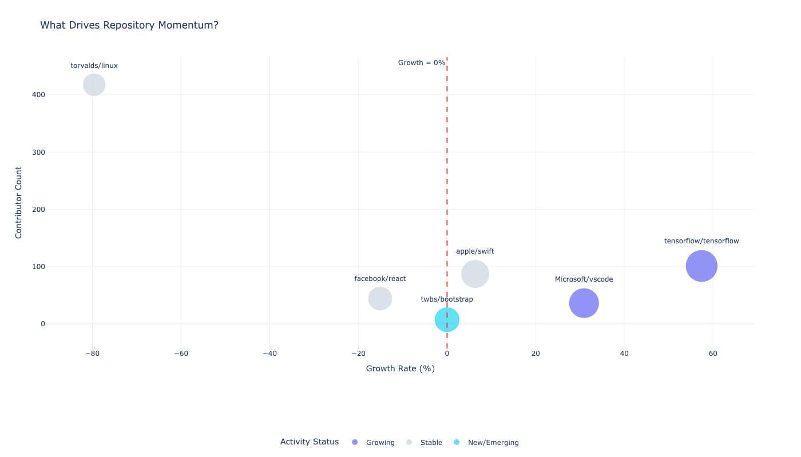
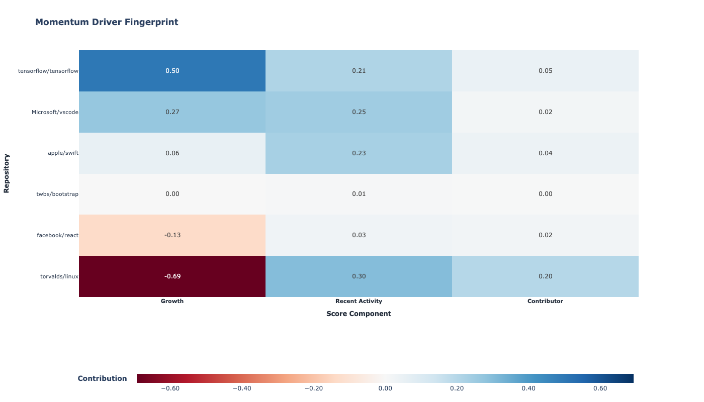
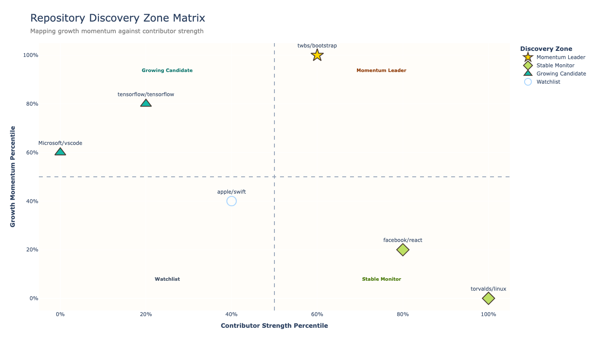

# GitHub Repository Momentum Prototype

A SQL, Python, and Streamlit analytics project for exploring repository-level momentum using public GitHub commit data.

This project transforms raw GitHub commit records into interpretable repository signals, including recent activity, prior-period activity, growth rate, contributor participation, normalized momentum score, and discovery-zone classification.

The goal is not to create a production-grade GitHub ranking system. Instead, this project demonstrates how public developer activity data can be cleaned, modeled, scored, visualized, and interpreted as a portfolio-ready analytics workflow.

---


## Interactive Dashboard Preview

The Streamlit dashboard provides filter-responsive KPI summaries and four interactive Plotly views built from the finalized repository momentum outputs.



---


## Analytical Question

GitHub repositories generate large amounts of activity data, but raw commit counts alone do not explain whether a repository is gaining momentum, slowing down, or simply large because of its historical scale.

This project explores the question:

> How can public GitHub commit data be used to compare repository activity, growth, and contributor participation in a more interpretable way?

---

## Project Objective

The project builds a repository-level momentum prototype that:

- compares recent commit activity against prior-period activity,
- calculates repository growth rate,
- measures contributor participation,
- normalizes activity signals for fairer comparison,
- creates a composite momentum score,
- separates repositories into discovery zones,
- and visualizes the results through notebook-based and interactive Streamlit dashboards.

---

## Notebook Analysis Preview

### 1. Repository Momentum Ranking

This chart ranks repositories by normalized momentum score.



---

### 2. What Drives Repository Momentum?

This chart compares growth rate, contributor count, and recent activity to explain what is driving each repository’s momentum.



---

### 3. Momentum Driver Fingerprint

This heatmap breaks the final momentum score into its underlying components: growth, recent activity, and contributor participation.



---

### 4. Repository Discovery Zone Matrix

This matrix classifies repositories into discovery zones based on growth momentum percentile and contributor strength percentile.



---

## Analytical Framework

- **Data source:** `bigquery-public-data.github_repos.sample_commits`
- **Fixed analysis date:** `2016-06-22`

The project follows a staged SQL-based analytical workflow.

### 1. Growth Analysis

Recent repository activity is compared with the previous 30-day period.

The growth rate is calculated as:

```text
(commits_last_30_days - commits_prev_30_days) / commits_prev_30_days
```

This allows the analysis to distinguish repositories that are currently accelerating from repositories that are active but slowing down.

### 2. Repository Momentum Score

The first momentum score combines three signals:

- growth rate,
- recent commit activity,
- contributor count.

This creates a simple composite view of repository momentum rather than relying on raw commit volume alone.

### 3. Normalized Momentum Score

Because raw commit counts and contributor counts can be on very different scales, the project normalizes major score components before combining them.

The normalized score helps compare repositories more fairly across different activity levels.

### 4. Repository Discovery Zone Matrix

Repositories are classified using percentile-based thresholds:

- high growth + high contributor strength → Momentum Leader,
- high growth + lower contributor strength → Growing Candidate,
- lower growth + high contributor strength → Stable Monitor,
- lower growth + lower contributor strength → Watchlist.

This classification is separate from the finalized normalized momentum score.
Charts 1–3 rank and explain repositories using weighted growth, recent
activity, and contributor components, while Chart 4 creates a percentile-based
segmentation using growth momentum and contributor strength.

For repositories without a usable prior-period baseline, the discovery query
applies an adjusted growth value before percentile ranking. This is why
`twbs/bootstrap` requires cautious interpretation despite appearing in the
Momentum Leader zone.

This creates an exploratory discovery layer that is easier to interpret than a single ranking alone.

---

## Dashboard Story

The notebook prototype and interactive Streamlit dashboard follow the same analytical walkthrough:

1. **Repository Momentum Ranking** — which repositories score highest?
2. **What Drives Repository Momentum?** — is momentum driven by growth, contributors, or recent activity?
3. **Momentum Driver Fingerprint** — which score components explain each repository’s position?
4. **Repository Discovery Zone Matrix** — how can repositories be grouped into interpretable discovery zones?

Together, these views move from ranking to explanation to classification.

---

## Tools Used

- Google BigQuery
- SQL
- Python
- Pandas
- Plotly
- Streamlit
- Jupyter Notebook
- GitHub

---

## Project Structure

| Folder / File | Purpose |
|---|---|
| `queries/` | SQL queries used to create repository-level momentum metrics. |
| `queries/01_growth_analysis.sql` | Calculates recent versus prior-period commit growth. |
| `queries/02_repository_momentum_score.sql` | Builds the first composite repository momentum score. |
| `queries/03_normalized_momentum_score.sql` | Normalizes growth, recent activity, and contributor components. |
| `queries/04_repository_discovery_radar.sql` | Creates percentile-based discovery zones for repository classification. |
| `data/README.md` | Notes on data sourcing and why raw datasets are not stored in the repository. |
| `data/processed/` | Final processed CSV outputs used by the notebook and dashboard. |
| `notebooks/01_repository_momentum_dashboard.ipynb` | Notebook-based dashboard prototype built with Python and Plotly. |
| `docs/assets/charts/` | Exported PNG chart assets used in the README and documentation. |
| `app/streamlit_app.py` | Interactive Streamlit dashboard built from the finalized processed CSV outputs. |
| `.streamlit/config.toml` | Streamlit theme and application configuration. |
| `requirements.txt` | Python package dependencies required to run the dashboard. |
| `INSIGHTS.md` | Summary of key analytical insights and project limitations. |

---

## Key Insights

- Raw commit activity alone is not enough to describe repository momentum.
- Growth rate needs context because high growth can result from a small prior-period baseline.
- Contributor participation adds an ecosystem-strength dimension to the analysis.
- Normalization makes repositories easier to compare across different activity levels.
- Discovery zones provide an interpretable portfolio-style view of repository activity.


### Selected Findings

- `tensorflow/tensorflow` records the highest finalized normalized momentum
  score in the sample at `0.76`, supported primarily by its strong growth
  component.
- `Microsoft/vscode` ranks second at `0.53`, combining positive growth with
  substantial recent activity.
- `torvalds/linux` has the broadest contributor base in the comparison set,
  but sharply negative short-term growth lowers its final momentum score.
- `twbs/bootstrap` is classified as New/Emerging because it lacks a usable
  prior-period baseline. Its Momentum Leader discovery-zone placement partly
  reflects an imputed top growth percentile and should therefore be interpreted
  cautiously.

---

## Scope and Limitations

This is a repository-level exploratory analytics prototype.

It uses public GitHub sample commit data and focuses on commit activity, growth, and contributor participation.

It does not include:

- stars,
- forks,
- issues,
- pull requests,
- topics,
- bot filtering,
- repository metadata,
- or real-time GitHub activity.

The results should be interpreted as an exploratory momentum analysis, not as a production GitHub ranking system or real-time technology trend engine.

---

## Future Improvements

Potential extensions include:

- adding stars, forks, issues, pull requests, and watchers,
- filtering bot and automation activity,
- adding repository topics and metadata,
- expanding the analysis across multiple months,
- tracking consistency and acceleration over time,
- and deploying the Streamlit dashboard for public portfolio access.

---

## Current Status

The repository momentum analysis, SQL workflow, notebook prototype, and
redesigned interactive Streamlit dashboard are complete.

The dashboard has been validated locally and is ready for public deployment.

Run the dashboard locally with:

```bash
python -m streamlit run app/streamlit_app.py
```